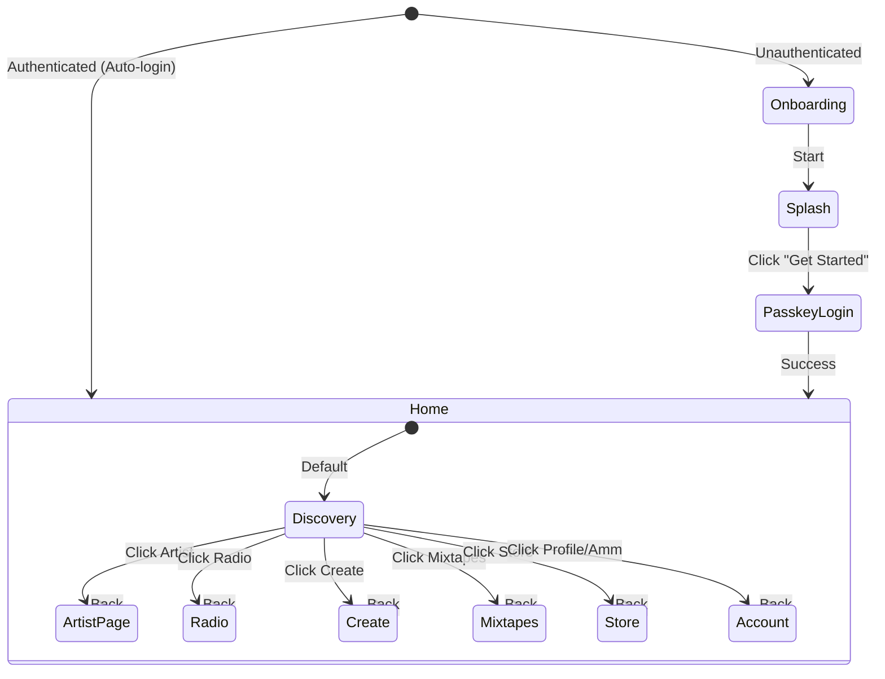
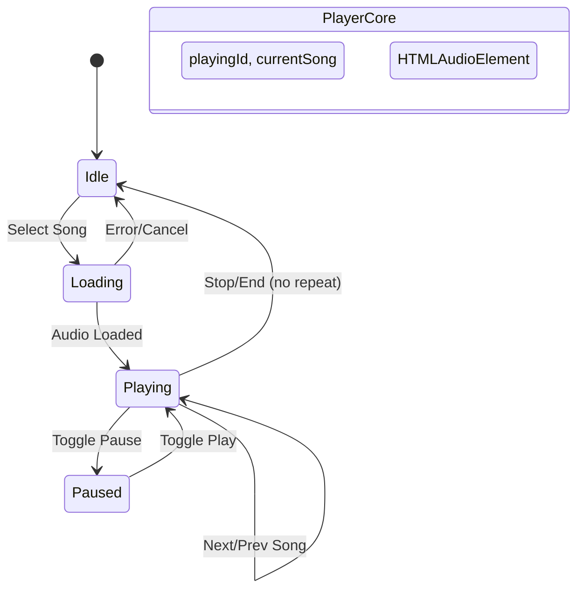
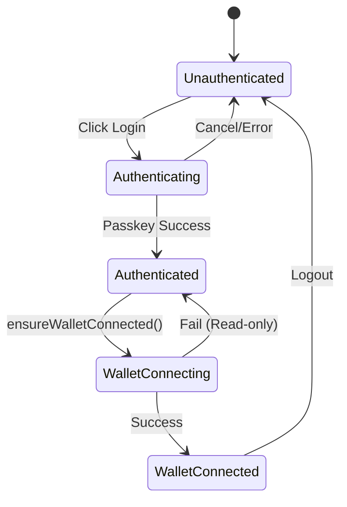
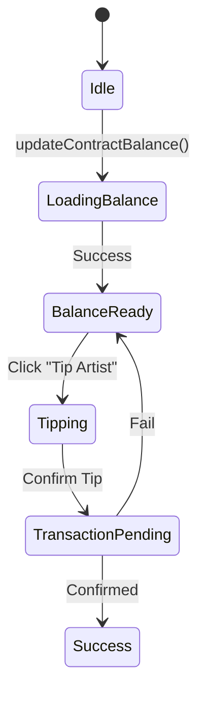

# Smol Ecosystem State Machine

## 1. App Routing & UI Flow


## 2. Audio & Player Flow


## 3. Data Fetch & Caching (Hybrid Strategy)
```mermaid
stateDiagram-v2
    [*] --> Fetching: App Load
    
    Fetching --> LiveAPI: Network OK
    Fetching --> SnapshotFallback: Network Error / API Empty
    
    LiveAPI --> Merging: Got Live Data
    SnapshotFallback --> Merging: Load Local JSON
    
    Merging --> Hydration: Merge Fields (Tags, Address)
    Hydration --> Ready: UI Updated
    
    state "Snapshot" as S {
        GalacticSnapshot.json: Pre-built
        universal-smols.json: Full Dump
    }
```

## 4. Auth & Wallet Flow (Passkey)


## 5. Tipping & Payments Flow


---

## Test Checklist

### [ ] Flow 1: App Routing
- Verification: `pnpm check` (verify imports/types in pages), `grep` for `navigate` calls.
- SSR Check: Ensure `astro:transitions/client` used correctly.

### [ ] Flow 2: Audio/Player
- Verification: `pnpm test` (if contains audio logic tests), `svelte-check` for `audioState` usage.
- SSR Check: Verify `audioState.audioElement` is only accessed in `onMount` or `isBrowser` guards.

### [ ] Flow 3: Data Fetching (Hybrid)
- Verification: `pnpm build` (verify static data generation), `grep` for `fetchSmols` fallbacks.
- Manual Script Check: `validate_tags.js` (if exists and relevant).

### [ ] Flow 4: Auth (Passkey)
- Verification: `pnpm check`, Check `passkey-kit` dependency status.

### [ ] Flow 5: Tipping/Payments
- Verification: `pnpm check`, Check contract balance update logic in `balance.svelte.ts`.

---

## Baseline Verification Results

| Flow | Covered by `pnpm check` | Covered by `pnpm test` | Build Safe? |
| :--- | :--- | :--- | :--- |
| Routing | [x] | [ ] | [x] |
| Audio | [x] | [ ] | [x] |
| Data | [x] | [ ] | [x] |
| Auth | [x] | [ ] | [x] |
| Payments | [x] | [ ] | [x] |

> [!NOTE]
> Fixed missing `smolIds` property in `getMixtapeDetail` (src/services/api/mixtapes.ts). This resolved a type error where `MixtapeDetail` required `smolIds`.
