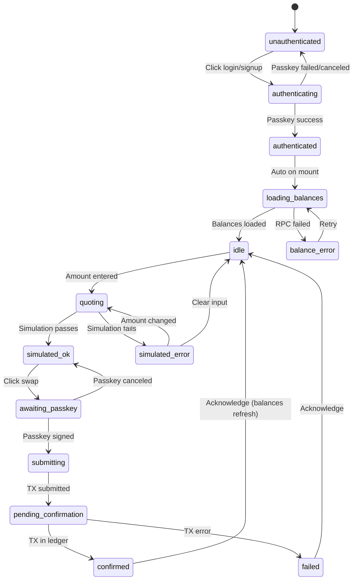
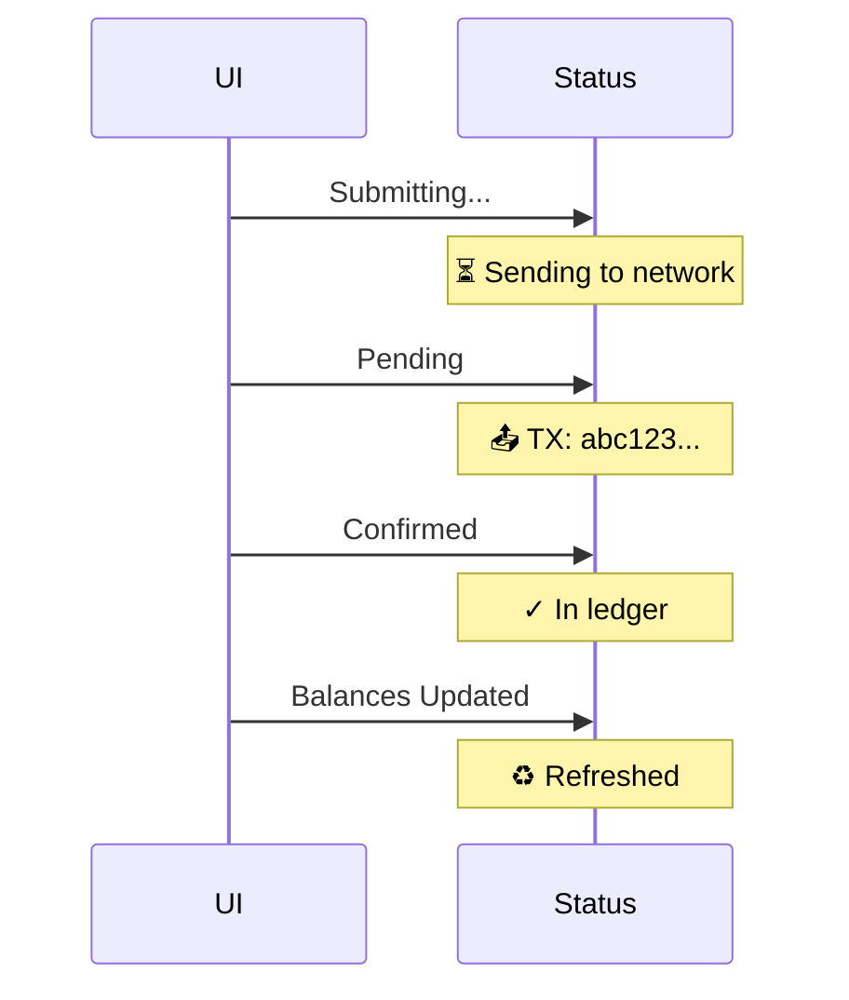

# Labs Swapper: Kale Forest Specification

> UX/UI spec for the "Magical Kale Forest" swapper experience in `/labs/swapper`.

---

## Overview

The swapper at `/labs/swapper` receives a visual upgrade: while the rest of Labs maintains the "black-label ops" theme, the swapper panel transforms into a **surprise "Kale Forest"** showpiece—warm, magical, pixelated Disney-grade energy.

### Design Philosophy

- **Surprise divergence**: High-tech lab → magical forest transition
- **Still pixel**: Pixel fonts, crisp edges, high craft
- **Functional first**: Swap controls are never blocked by aesthetics
- **Neutral tone**: No price talk, no direction pushing

---

## Location & Slot

| Property | Value |
|----------|-------|
| Route | `/labs/swapper` |
| Layout | `src/pages/labs/swapper.astro` |
| Component | `src/components/labs/SwapperCore.svelte` |
| Container | `max-w-xl`, centered, `z-20` |

**Constraint**: All changes happen INSIDE `SwapperCore.svelte`. The page layout remains unchanged.

---

## Component Map

```
SwapperCore.svelte
├── PasskeySplash (if not authenticated)
│   ├── ExplainerText
│   ├── CreatePasskeyButton
│   └── SignInButton
│
├── KaleForestSwapper (if authenticated)
│   ├── ForestBackground
│   │   ├── ParallaxLayer (trees)
│   │   ├── ParallaxLayer (motes)
│   │   └── ParallaxLayer (birds)
│   │
│   ├── BalancePanel
│   │   ├── XLMBalance
│   │   └── KALEBalance
│   │
│   ├── SwapControls
│   │   ├── DirectionToggle (XLM↔KALE)
│   │   ├── AmountInput
│   │   ├── QuoteDisplay
│   │   │   ├── OutputAmount
│   │   │   ├── MinReceived
│   │   │   ├── PriceImpact
│   │   │   └── Route
│   │   ├── PreflightBadge ("ok" / "error")
│   │   └── SwapButton
│   │
│   ├── DepositPanel (if 0 XLM)
│   │   ├── SmartWalletAddress
│   │   ├── CopyButton
│   │   ├── QRCode
│   │   └── StoryCards (optional)
│   │
│   └── ConfirmationTimeline
│       ├── StatusMessage
│       ├── TxHash (clickable)
│       └── BalanceRefreshIndicator
```

---

## State Machine



---

## Visual Theme: Kale Forest

### Color Palette

| Role | Color | Usage |
|------|-------|-------|
| Background | `#0a1f0a` | Deep forest |
| Trees | `#1a3a1a` | Silhouette layers |
| Kale leaves | `#4a7a2a` | Glowing accents |
| Highlights | `#9ae600` | Primary brand |
| Starlight | `#fff4d4` | XLM representation |
| Text | `#e0e0e0` | Readable |

### Animation Elements

| Element | Motion | Reduced Motion |
|---------|--------|----------------|
| Floating motes | Slow drift upward | Static dots |
| Tree sway | Gentle oscillation | None |
| Birds | Circling (state indicators) | Static icons |
| Parallax | Subtle depth | Flat layers |

### Transition

```
Lab Theme → Kale Forest
┌────────────────────────────────────────┐
│ 0ms:   Lab border visible              │
│ 100ms: "Portal" glow effect            │
│ 500ms: Forest fades in                 │
│ 800ms: Swap controls appear            │
│ 1000ms: Fully revealed                 │
└────────────────────────────────────────┘

Reduced motion: Instant swap, no transition
```

---

## The Story (Optional)

### Premise

An alien lands on Earth. No exchange. No bank. No friends. How do they get their first XLM?

### Story Cards (3)

1. **Identity**: "A key that belongs only to you" (passkey explainer)
2. **Value**: "Create something, and value finds you" (music → tips)
3. **First Lumen**: "Your first starlight arrives" (deposit/earn paths)

### Tie-In

> "One way to get your first XLM that's even better than mining kale: write music."
> Make a track → Get tipped → Receive your first XLM.

### Controls

- Story cards appear as expandable panel
- "Skip story" toggle (stored in localStorage)
- Story never blocks swap controls

---

## Deposit Panel (Zero-Balance UX)

When wallet has 0 XLM:

```
┌─────────────────────────────────────────┐
│   Your wallet is ready for starlight    │
├─────────────────────────────────────────┤
│                                         │
│   Smart Wallet Address:                 │
│   ┌───────────────────────────────────┐ │
│   │ CBNORBI4DCE...IACJ33IM     [Copy] │ │
│   └───────────────────────────────────┘ │
│                                         │
│        ┌──────────────┐                 │
│        │   QR Code    │                 │
│        │              │                 │
│        └──────────────┘                 │
│                                         │
│   Send XLM to this address to begin.    │
│                                         │
│   ┌─────────────────────────────────┐   │
│   │ 🎵 Or: Earn XLM by making music │   │
│   └─────────────────────────────────┘   │
│                                         │
└─────────────────────────────────────────┘
```

---

## Swap Controls Detail

### Inputs

| Field | Type | Validation |
|-------|------|------------|
| Amount | number | > 0, <= balance |
| Direction | toggle | XLM→KALE or KALE→XLM |
| Slippage | preset | 0.5%, 1%, 3% (default 1%) |

### Quote Display

```
You Send:    [1.0000000] XLM
You Receive: [292.4167133] KALE (estimated)
Min Received: 289.4925562 KALE (1% slippage)
Price Impact: 2.11% ⚠
Route: soroswap (3-hop)
```

### Preflight Badge

| State | Badge | Color |
|-------|-------|-------|
| Not simulated | (none) | — |
| Simulating | `⏳ Checking...` | yellow |
| Simulation OK | `✓ Preflight OK` | green |
| Simulation Error | `✗ {error}` | red |

---

## Confirmation Timeline



---

## Acceptance Tests

| # | Test | Expected |
|---|------|----------|
| 1 | Wallet with 0 XLM | Shows deposit panel + story; no crash |
| 2 | Balances load | XLM and KALE balances display correctly |
| 3 | Balance refresh | Manual button updates values |
| 4 | Quote XLM→KALE | Shows estimated KALE output |
| 5 | Quote KALE→XLM | Shows estimated XLM output |
| 6 | Simulation blocks bad swap | Clear error message shown |
| 7 | Passkey prompt triggers | Browser passkey dialog appears |
| 8 | Submission returns hash | TX hash displayed |
| 9 | Hash resolves success | Status shows "Confirmed" |
| 10 | Balances update post-confirm | New balances reflected |
| 11 | Reduced motion | Heavy animations disabled |
| 12 | Mobile layout | No horizontal overflow |

---

## Implementation Plan

### Phase 1: Core Functionality (Current)

- [x] Quote fetching via Soroswap API
- [x] Direct aggregator contract invocation
- [x] Demo mode for testing
- [ ] Bidirectional swap (XLM↔KALE)
- [ ] Full signing via passkey (requires production domain)

### Phase 2: Balance Integration

- [ ] XLM balance in swap panel
- [ ] KALE balance in swap panel
- [ ] Auto-refresh after confirmation

### Phase 3: Kale Forest Theme

- [ ] Parallax forest background
- [ ] Portal transition animation
- [ ] Guardian birds state indicators
- [ ] Reduced motion support

### Phase 4: Story & Deposit

- [ ] Story cards component
- [ ] Deposit panel for 0-balance
- [ ] QR code generation
- [ ] "Earn via music" path

### Phase 5: /account Upgrade

- [ ] Add XLM balance to /account
- [ ] Add KALE balance to /account
- [ ] Add last TX hash display

---

## Files to Modify

| File | Changes |
|------|---------|
| `src/components/labs/SwapperCore.svelte` | Full UI rewrite with forest theme |
| `src/utils/soroswap.ts` | Add KALE→XLM direction support |
| `src/stores/balance.svelte.ts` | Add balance caching + refresh |
| `src/pages/account.astro` | Add XLM/KALE balance display |

---

## Performance Notes

- Lazy-load forest background after swap controls render
- Use CSS animations (not JS) for motes
- Spritesheet for birds (4 states, 32x32px each)
- Total additional assets: < 50KB

---

*Last updated: 2026-01-14*
