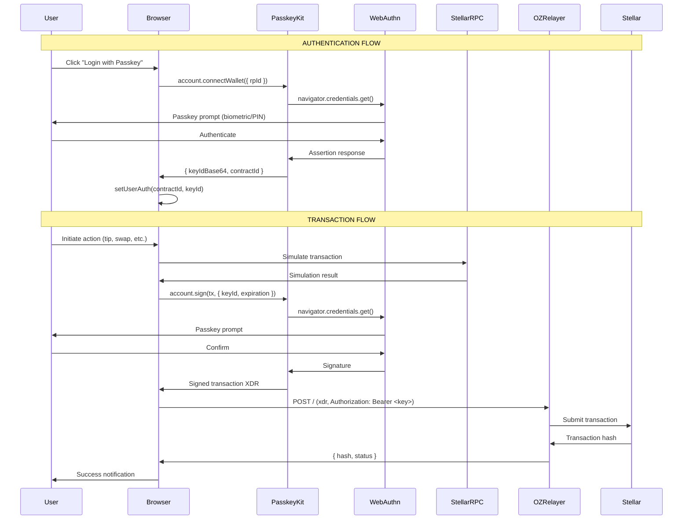
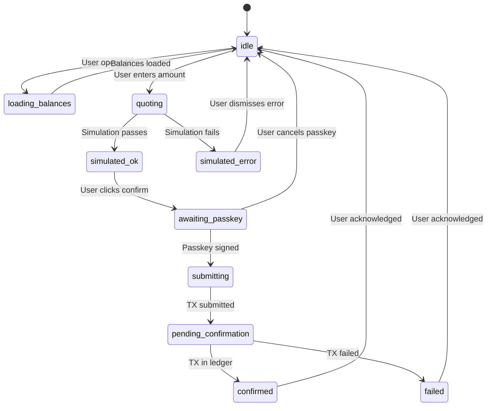

# Passkey-Kit + OpenZeppelin Relayer: Mainnet Implementation Guide

> **For humans + AI agents**: This document explains exactly how passkey authentication and transaction submission works in this codebase on Stellar mainnet.

## Overview

This repository uses:
- **passkey-kit v0.12.x** for WebAuthn-based smart wallet creation and transaction signing
- **Kale Farm API** for fee-sponsored transaction submission to Stellar mainnet (Turnstile-protected)

> [!NOTE]
> As of 2026-01, the relayer was migrated from OpenZeppelin Channels to Kale Farm API (`api.kalefarm.xyz`) for Turnstile-based Sybil resistance.

---

## Commits & Changelog

| Commit | File | What Changed | Why |
|--------|------|--------------|-----|
| `5fe8060` | `src/utils/passkey-kit.ts` | Added `send()` function | Migrate to OZ Relayer |
| `5fe8060` | Multiple hooks | Updated to use new `send()` | Unified relayer submission path |
| `743bbde` | `src/hooks/useAuthentication.ts` | Refactored passkey flows | Clarify guest entry vs authenticated |
| `b4199aa` | `src/stores/balance.svelte.ts` | Added XLM balance state | Phase G XLM balance integration |

---

## Architecture

### Core Files

| File | Purpose |
|------|---------|
| `src/utils/passkey-kit.ts` | PasskeyKit instantiation + `send()` function |
| `src/utils/rpc.ts` | RPC endpoint configuration |
| `src/hooks/useAuthentication.ts` | Login/signup/logout flows |
| `src/stores/user.svelte.ts` | User auth state management |

### Call Graph

```
┌─────────────────────────────────────────────────────────────┐
│                     CLIENT (Browser)                        │
├─────────────────────────────────────────────────────────────┤
│                                                             │
│  ┌──────────────────┐     ┌──────────────────────────────┐ │
│  │ useAuthentication│     │ Transaction Hooks            │ │
│  │ - login()        │     │ - useKaleTransfer.ts         │ │
│  │ - signUp()       │     │ - useMixtapeSupport.ts       │ │
│  │ - logout()       │     │ - useMixtapePurchase.ts      │ │
│  └────────┬─────────┘     │ - useTradeExecution.ts       │ │
│           │               └──────────────┬───────────────┘ │
│           │                              │                 │
│           ▼                              ▼                 │
│  ┌──────────────────────────────────────────────────────┐  │
│  │           src/utils/passkey-kit.ts                   │  │
│  │  ┌─────────────────┐  ┌─────────────┐  ┌──────────┐  │  │
│  │  │ account         │  │ sac         │  │ send()   │  │  │
│  │  │ (PasskeyKit)    │  │ (SACClient) │  │ (Relayer)│  │  │
│  │  │ - connectWallet │  │ - kale      │  │          │  │  │
│  │  │ - createWallet  │  │ - xlm       │  │          │  │  │
│  │  │ - sign          │  │             │  │          │  │  │
│  │  └────────┬────────┘  └──────┬──────┘  └────┬─────┘  │  │
│  └───────────│──────────────────│──────────────│────────┘  │
│              │                  │              │           │
└──────────────│──────────────────│──────────────│───────────┘
               │                  │              │
               ▼                  ▼              ▼
        ┌──────────────┐  ┌──────────────┐  ┌──────────────┐
        │  WebAuthn    │  │  Stellar     │  │  OZ Relayer  │
        │  (Browser    │  │  RPC         │  │  Channels    │
        │   Passkey)   │  │  (Mainnet)   │  │  (Mainnet)   │
        └──────────────┘  └──────────────┘  └──────────────┘
```

---

## Sequence Diagram: Full Transaction Lifecycle



---

## State Machine: Transaction UI States



---

## Configuration

### Required Environment Variables

| Variable | Purpose | Where Read |
|----------|---------|------------|
| `PUBLIC_RPC_URL` | Stellar RPC endpoint | `src/utils/rpc.ts:2` |
| `PUBLIC_NETWORK_PASSPHRASE` | Network identifier | `src/utils/passkey-kit.ts:8` |
| `PUBLIC_WALLET_WASM_HASH` | Smart wallet WASM hash | `src/utils/passkey-kit.ts:9` |
| `PUBLIC_WEBAUTHN_VERIFIER_ADDRESS` | WebAuthn verifier contract address | `src/utils/passkey-kit.ts` |
| `PUBLIC_CHANNELS_BASE_URL` | OZ Relayer endpoint | `src/utils/passkey-kit.ts:43` |
| `PUBLIC_CHANNELS_API_KEY` | OZ Relayer auth key | `src/utils/passkey-kit.ts:44` |
| `PUBLIC_KALE_SAC_ID` | KALE token contract | `src/utils/passkey-kit.ts:19` |
| `PUBLIC_XLM_SAC_ID` | XLM SAC contract | `src/utils/passkey-kit.ts:24` |
| `PUBLIC_API_URL` | Backend API endpoint | `src/hooks/useAuthentication.ts:17` |

### .env.example

```bash
# Stellar RPC (Mainnet)
PUBLIC_RPC_URL=https://rpc.eu-central-8.gateway.fm/v4/stellar/mainnet
PUBLIC_NETWORK_PASSPHRASE="Public Global Stellar Network ; September 2015"

# Smart Wallet
PUBLIC_WALLET_WASM_HASH=ecd990f0b45ca6817149b6175f79b32efb442f35731985a084131e8265c4cd90
PUBLIC_WEBAUTHN_VERIFIER_ADDRESS=<C_ADDRESS>

# Token Contracts (Mainnet)
PUBLIC_KALE_SAC_ID=CB23WRDQWGSP6YPMY4UV5C4OW5CBTXKYN3XEATG7KJEZCXMJBYEHOUOV
PUBLIC_XLM_SAC_ID=CAS3J7GYLGXMF6TDJBBYYSE3HQ6BBSMLNUQ34T6TZMYMW2EVH34XOWMA
PUBLIC_AGGREGATOR_CONTRACT_ID=CAG5LRYQ5JVEUI5TEID72EYOVX44TTUJT5BQR2J6J77FH65PCCFAJDDH

# API Keys (set in Cloudflare Dashboard, NOT in source)
# PUBLIC_SOROSWAP_API_KEY=<set in CF Dashboard>
# PUBLIC_CHANNELS_API_KEY=<set in CF Dashboard>

# Backend
PUBLIC_API_URL=https://api.smol.xyz
```

---

## Relayer Request/Response

### Request Shape (Kale Farm API)

```http
POST / HTTP/1.1
Host: api.kalefarm.xyz
Content-Type: application/json
X-Turnstile-Response: <turnstile-token>

{"xdr": "<base64-encoded-transaction-XDR>"}
```

### Response Shape (Success)

```json
{
  "hash": "abc123...",
  "status": "PENDING"
}
```

### Response Shape (Error)

```
HTTP/1.1 400 Bad Request
<error message text>
```

### Code Reference (Current Implementation)

```typescript
// src/utils/passkey-kit.ts
export async function send<T>(txn: AssembledTransaction<T> | Tx | string, turnstileToken: string) {
    let xdr: string;
    if (txn instanceof AssembledTransaction) {
        xdr = txn.built!.toXDR();
    } else if (typeof txn !== 'string') {
        xdr = txn.toXDR();
    } else {
        xdr = txn;
    }

    const relayerUrl = "https://api.kalefarm.xyz";

    const response = await fetch(`${relayerUrl}/`, {
        method: 'POST',
        headers: {
            'Content-Type': 'application/json',
            'X-Turnstile-Response': turnstileToken,
        },
        body: JSON.stringify({ xdr }),
    });

    if (!response.ok) {
        const errorText = await response.text();
        throw new Error(`Relayer submission failed: ${response.status} ${response.statusText} - ${errorText}`);
    }

    return response.json();
}
```

---

## Verification Checklist

### Build Verification

```bash
# Install dependencies
ppnpm install

# Build check (svelte-check)
pnpm check

# Dev server
pnpm dev
```

### Deployment Environment

Verify that the `PUBLIC_RELAYER_URL` and `PUBLIC_RELAYER_API_KEY` are correctly set in the production environment.

### Transaction Verification (Requires TX Hash)

```bash
# Verify transaction on Stellar Expert
curl "https://api.stellar.expert/explorer/public/tx/<TX_HASH>"

# Or via Horizon
curl "https://horizon.stellar.org/transactions/<TX_HASH>"
```

---

## Call Sites Using `send()`

| File | Line | Context |
|------|------|---------|
| `src/hooks/useAuthentication.ts` | 91 | Wallet creation (signUp) |
| `src/hooks/useKaleTransfer.ts` | 58 | KALE token transfers |
| `src/hooks/useMixtapeSupport.ts` | 174 | Mixtape support transactions |
| `src/hooks/useMixtapePurchase.ts` | 49 | Mixtape purchases |
| `src/hooks/useTradeExecution.ts` | 40 | Trade execution |
| `src/components/artist/TipArtistModal.svelte` | 156 | Artist tipping |
| `src/components/Account.svelte` | 120 | Account transactions |

---

## Upstream Alignment

### PasskeyKit Instantiation

Our implementation matches upstream:

```typescript
// src/utils/passkey-kit.ts:6-11
export const account = new PasskeyKit({
    rpcUrl: RPC_URL,
    networkPassphrase: import.meta.env.PUBLIC_NETWORK_PASSPHRASE,
    walletWasmHash: import.meta.env.PUBLIC_WALLET_WASM_HASH,
    timeoutInSeconds: 30,
});
```

### Divergences

| Aspect | Upstream | Our Implementation | Reason |
|--------|----------|-------------------|--------|
| Auth method | Turnstile token | Bearer API key | Simpler integration |
| Submission path | Server-side | Client-side `send()` | Unified with hooks |
| Error handling | Custom types | String errors | Simpler debugging |

---

## How to Reproduce

1. Clone repository
2. Copy `.env.example` to `.env` and fill in secrets
3. Run `ppnpm install`
4. Run `pnpm dev`
5. Navigate to `/labs/swapper?demo=true` for demo mode
6. For real transactions: use production domain with valid passkey

---

*Last updated: 2026-01-16*
*Ralph Hardening Audit: H-003 documentation sync applied*
