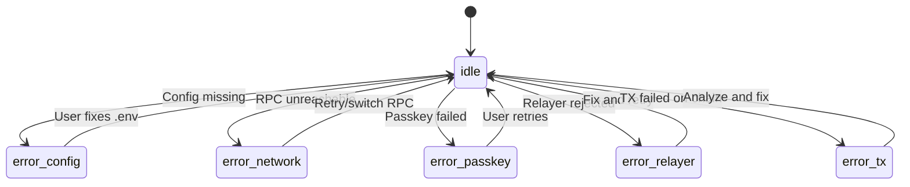

# Passkey-Kit + OZ Relayer: Operational Runbook

> Troubleshooting matrix and failure mode catalog for the passkey authentication and relayer submission system.

---

## Quick Diagnostic Commands

```bash
# Check build status
pnpm check

# Search for legacy references (should return empty)
rg -i "kale-relayer" --type ts

# Verify env vars are set
grep -E "PUBLIC_CHANNELS|PUBLIC_RPC|PUBLIC_NETWORK" .env

# Test RPC connectivity
curl -X POST -H "Content-Type: application/json" \
  -d '{"jsonrpc":"2.0","id":1,"method":"getHealth"}' \
  "$PUBLIC_RPC_URL"

# Test relayer connectivity
curl -I https://channels.openzeppelin.com
```

---

## Failure Mode Matrix

### Category 1: Relayer Auth/Config Errors

| Symptom | Likely Cause | How to Confirm | Smallest Fix | Prevention |
|---------|--------------|----------------|--------------|------------|
| `401 Unauthorized` from relayer | Missing/invalid API key | Check `PUBLIC_CHANNELS_API_KEY` is set | Add valid key to `.env` | Validate in CI |
| `Relayer API key not configured` | Env var not loaded | `console.log(import.meta.env.PUBLIC_CHANNELS_API_KEY)` | Restart dev server after `.env` change | Document reload requirement |
| `fetch failed` to relayer | Wrong base URL | Verify `PUBLIC_CHANNELS_BASE_URL` | Fix URL in `.env` | Use default fallback |
| `403 Forbidden` | Key revoked or IP blocked | Test with curl from same network | Contact OZ support | Monitor key health |

### Category 2: Network Mismatch

| Symptom | Likely Cause | How to Confirm | Smallest Fix | Prevention |
|---------|--------------|----------------|--------------|------------|
| `Network passphrase mismatch` | Wrong network config | Check `PUBLIC_NETWORK_PASSPHRASE` | Set correct passphrase | Environment-specific configs |
| Transaction simulation fails with `NETWORK` error | RPC and passphrase mismatch | Compare RPC URL to passphrase | Align both to same network | Use named configs |
| `Contract not found` | Contract on different network | Verify contract ID matches network | Use correct contract IDs | Document per-network IDs |
| Wallet creation fails | WASM hash for wrong network | Check `PUBLIC_WALLET_WASM_HASH` | Use mainnet WASM hash | Lock per environment |

### Category 3: XDR/Signature Issues

| Symptom | Likely Cause | How to Confirm | Smallest Fix | Prevention |
|---------|--------------|----------------|--------------|------------|
| `Invalid XDR` | XDR encoding issue | Decode XDR with stellar-cli | Check transaction building | Add XDR validation |
| `Signature invalid` | Wrong key signed | Verify keyId matches wallet | Use correct keyId from connectWallet | Store keyId securely |
| `Auth expired` | Ledger sequence too low | Check expiration vs current ledger | Increase expiration buffer | Use `sequence + 100` |
| Passkey prompt never appears | rpId mismatch | Check `getDomain()` result | Verify domain registration | Test on target domain |

### Category 4: Simulation/Resource Errors

| Symptom | Likely Cause | How to Confirm | Smallest Fix | Prevention |
|---------|--------------|----------------|--------------|------------|
| `CPU exhausted` | Complex contract call | Check simulation metrics | Optimize contract call | Set resource limits |
| `Memory exceeded` | Large data in contract | Review contract storage access | Reduce data scope | Profile before deploy |
| `Footprint too large` | Too many entries | Count entries in simulation | Reduce state access | Design for minimal footprint |
| `Insufficient fee` | Fee too low for resources | Check fee in simulation result | Increase fee | Use simulation fee |

### Category 5: Client/Server Boundary

| Symptom | Likely Cause | How to Confirm | Smallest Fix | Prevention |
|---------|--------------|----------------|--------------|------------|
| CORS error to relayer | Missing CORS headers | Check browser console | N/A (relayer issue) | Use server-side submission |
| `window is not defined` | SSR context | Check if browser context | Guard with `typeof window` | Use `onMount` guards |
| Cookie not set | Domain mismatch | Check cookie in devtools | Verify domain config | Use `.domain` in cookie opts |
| Session lost on refresh | Cookie not persisted | Check `expires` in cookie | Set longer expiry | Use 30-day default |

### Category 6: Confirmation/Indexing Lag

| Symptom | Likely Cause | How to Confirm | Smallest Fix | Prevention |
|---------|--------------|----------------|--------------|------------|
| TX hash returned but not found | Indexer lag | Wait 5s and retry | Add retry logic | Poll with backoff |
| Balance not updated | Cache stale | Force refresh | Add manual refresh button | Auto-refresh after TX |
| `PENDING` forever | TX not included | Check horizon for TX status | Resubmit with higher fee | Monitor TX lifecycle |
| Double submission | User retried | Check for duplicate hash | Debounce submit button | Disable button during submit |

---

## State Machine: Error Recovery



---

## Debug Checklist

### Before Filing a Bug

- [ ] Confirmed `.env` has all required variables
- [ ] Ran `pnpm check` with no new errors
- [ ] Tested on production domain (not localhost for passkeys)
- [ ] Captured browser console logs
- [ ] Captured network tab for relayer request
- [ ] Noted exact error message and stack trace
- [ ] Verified transaction hash on stellar.expert

### Log Collection

```javascript
// Add these to debug transactions:
console.log('Env check:', {
  rpc: import.meta.env.PUBLIC_RPC_URL,
  network: import.meta.env.PUBLIC_NETWORK_PASSPHRASE,
  relayer: import.meta.env.PUBLIC_CHANNELS_BASE_URL,
  hasKey: !!import.meta.env.PUBLIC_CHANNELS_API_KEY
});

// Before signing:
console.log('Pre-sign:', { keyId, contractId, txXdr: tx.toXDR?.() });

// After send():
console.log('Post-send:', result);
```

---

## Recovery Procedures

### Stuck Transaction

1. Get transaction hash from error or logs
2. Check status: `curl https://horizon.stellar.org/transactions/<hash>`
3. If not found: transaction was never submitted, safe to retry
4. If failed: analyze `result_xdr` for failure reason
5. If pending: wait up to 60 seconds for inclusion

### Passkey Not Working

1. Verify domain matches passkey registration
2. Check browser supports WebAuthn
3. Try different browser/device
4. Check if passkey was created on this device
5. Create new wallet as fallback

### Relayer Rejecting Transactions

1. Verify API key is valid
2. Check transaction XDR is valid: decode with stellar-cli
3. Ensure transaction is signed
4. Verify fee is sufficient
5. Contact OZ support if persistent

---

## Monitoring Recommendations

| Metric | Alert Threshold | Response |
|--------|-----------------|----------|
| Relayer 4xx rate | > 5% | Check API key, review submissions |
| Relayer 5xx rate | > 1% | Escalate to OZ |
| TX confirmation time | > 30s | Increase fee, check network |
| Passkey failure rate | > 10% | Check domain config |
| Balance fetch errors | > 5% | Switch RPC endpoint |

---

*Last updated: 2026-01-14*
